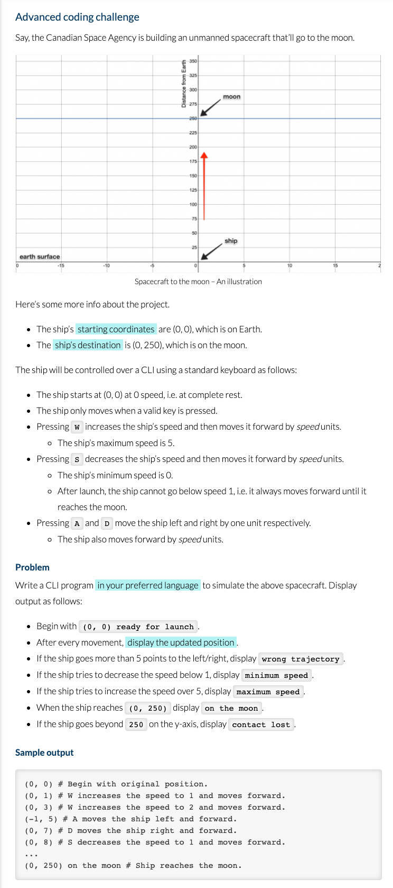

# Spacecraft


A simple CLI to solve the Spacecraft Problem, made with [TypeScript](https://www.typescriptlang.org/)

Let's build a rocket together!


## The Problem



# Getting started

## Installation

To get started locally, follow these instructions:

1.  Clone to your local computer using `git`.
2.  Make sure you have Node installed; see instructions [here](https://nodejs.org/en/download/).
3.  Make sure that you have `yarn` installed; see instructions [here](https://yarnpkg.com/lang/en/docs/install/).
4.  Run `yarn install` to install dependencies.

## Usage

```sh
# starts 🚀 on coordinates (0,0) - Earth
yarn start

# Use W, A, S, or D  to starting control 🚀 .
```

## Build the CLI bundle

```sh
yarn build
```

## Run tests

```sh
yarn test
```

## Contributors

<a href="https://github.com/pyymenta/spacecraft-cli/graphs/contributors">
  
</a>
